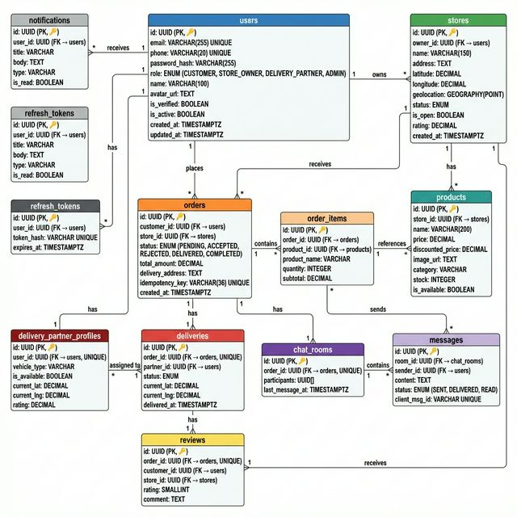

# ER Diagram — Hyperlocal Quick-Commerce Platform

---

## Table Summary

| Table | Primary Key | Key Foreign Keys | Purpose |
|---|---|---|---|
| `users` | `id` (UUID) | — | All platform users (customer, store owner, delivery, admin) |
| `stores` | `id` (UUID) | `owner_id → users` | Kirana store profiles with geolocation |
| `products` | `id` (UUID) | `store_id → stores` | Product catalog per store |
| `orders` | `id` (UUID) | `customer_id → users`, `store_id → stores` | Order records with idempotency key |
| `order_items` | `id` (UUID) | `order_id → orders`, `product_id → products` | Line items per order |
| `deliveries` | `id` (UUID) | `order_id → orders (UNIQUE)`, `partner_id → users` | Delivery assignments and tracking |
| `delivery_partner_profiles` | `id` (UUID) | `user_id → users (UNIQUE)` | Delivery partner info and availability |
| `chat_rooms` | `id` (UUID) | `order_id → orders (UNIQUE)` | Chat rooms per order |
| `messages` | `id` (UUID) | `room_id → chat_rooms`, `sender_id → users` | Individual messages with dedup key |
| `reviews` | `id` (UUID) | `order_id → orders (UNIQUE)`, `customer_id → users` | Ratings and comments |
| `notifications` | `id` (UUID) | `user_id → users` | In-app notifications |
| `refresh_tokens` | `id` (UUID) | `user_id → users` | JWT refresh token management |
| `audit_logs` | `id` (UUID) | `user_id → users` | System audit trail |

## Key Database Indexes

| Index | Table | Columns | Type | Purpose |
|---|---|---|---|---|
| Spatial Index | `stores` | `geolocation` | GIST | Nearby store geo queries |
| Composite | `orders` | `customer_id, status` | B-tree | Order history by customer |
| Composite | `orders` | `store_id, status` | B-tree | Order dashboard for store |
| Composite | `messages` | `room_id, created_at DESC` | B-tree | Paginated chat messages |
| Partial | `delivery_partner_profiles` | `is_available` (WHERE true) | B-tree | Available partner lookup |
| Full-Text | `products` | `name, description` | GIN | Product search |
| Unique | `orders` | `idempotency_key` | B-tree | Duplicate order prevention |

## Redis Data Structures

| Key Pattern | Type | Purpose | TTL |
|---|---|---|---|
| `geo:stores:{lat}:{lng}:{radius}` | String (JSON) | Cached nearby stores | 5 min |
| `store:products:{storeId}` | String (JSON) | Cached product list | 5 min |
| `idempotency:{key}` | String | Order dedup | 24 hr |
| `presence:{userId}` | String | Online/offline status | 30 sec |
| `delivery:locations` | GEO | Partner real-time locations | No TTL |
| `room:{roomId}:members` | SET | Socket room membership | Session |
