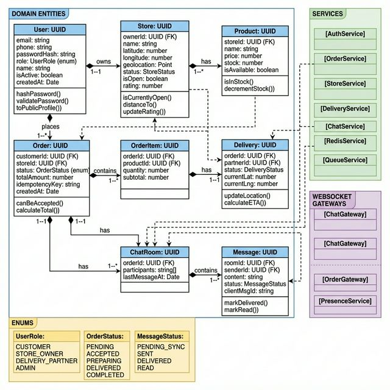

# Class Diagram — Hyperlocal Quick-Commerce Platform



---

## Architecture Overview

The system follows a **Domain-Driven Design (DDD)** approach with NestJS modules. Each module encapsulates its own entities, services, repositories, and controllers.

```
src/
├── auth/           # JWT, guards, RBAC
├── users/          # User entity & management
├── stores/         # Store profiles, geo-queries
├── products/       # Inventory management
├── orders/         # Order lifecycle
├── deliveries/     # Delivery tracking
├── chat/           # Real-time messaging
├── notifications/  # Push & in-app alerts
├── queues/         # BullMQ job processors
└── common/         # Shared DTOs, guards, interceptors
```

## Module Dependency Map

```
AuthModule
  └── UsersModule

StoresModule
  ├── ProductsModule
  └── RedisModule

OrdersModule
  ├── StoresModule
  ├── ProductsModule
  ├── UsersModule
  ├── RedisModule
  └── QueuesModule

DeliveriesModule
  ├── OrdersModule
  ├── UsersModule
  └── RedisModule

ChatModule
  ├── OrdersModule
  ├── UsersModule
  └── RedisModule

NotificationsModule
  ├── UsersModule
  └── QueuesModule
```

## Key Design Patterns

| Pattern | Usage |
|---|---|
| **Repository Pattern** | Each entity has a dedicated repository wrapping TypeORM |
| **CQRS (light)** | Read queries use Redis cache; writes go to PostgreSQL |
| **Observer** | Socket.io event emitters for real-time updates |
| **Strategy** | Conflict resolution strategies (last-write-wins, manual) |
| **Decorator** | NestJS `@UseGuards`, `@Roles`, `@WebSocketGateway` |
| **Factory** | `OrderFactory` creates orders with idempotency key |
| **Queue/Worker** | BullMQ producers in services, consumers in processors |
