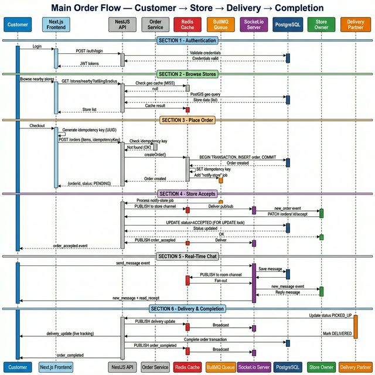
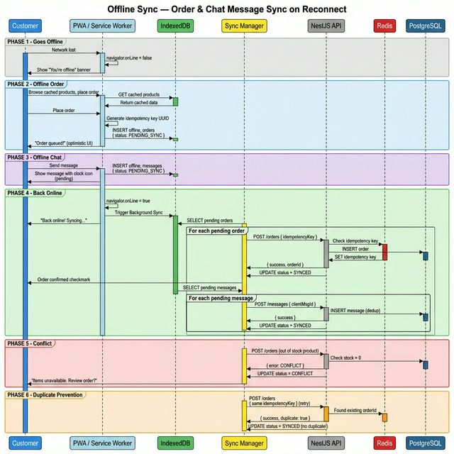

# Sequence Diagrams — Hyperlocal Quick-Commerce Platform

---

## Diagram 1: Main Order Flow

**Customer places order → Store accepts → Delivery assigned → Live chat → Delivery updates → Completion**

---

## Diagram 2: Offline Sync Scenario

**Customer goes offline → Places order locally → Sends chat messages → Reconnects → Background sync → Conflict resolution**

