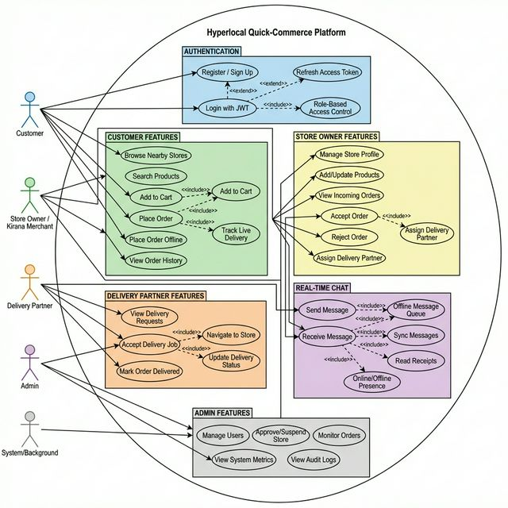

# Use Case Diagram — Hyperlocal Quick-Commerce Platform

---

## Actors

| Actor | Description |
|---|---|
| **Customer** | End user who browses stores, places orders, and chats |
| **Store Owner** | Kirana merchant who manages inventory and fulfills orders |
| **Delivery Partner** | Field agent who picks up and delivers orders |
| **Admin** | Platform administrator who manages users and monitors the system |
| **System (Background)** | Automated processes for sync, notifications, and presence |

## Key Relationships

### `<<include>>` (Always happens)
- **Place Order** includes **Add to Cart**
- **Login** includes **Role-Based Access Control**
- **Accept Delivery** includes **Navigate to Store**
- **Sync Offline Messages** includes **Idempotent Submission**

### `<<extend>>` (Conditionally happens)
- **Browse Stores** extends **Search Products**
- **Accept Order** extends **Assign Delivery Partner**
- **Update Status** extends **Mark Delivered**
- **Offline Order** extends **Place Order**
